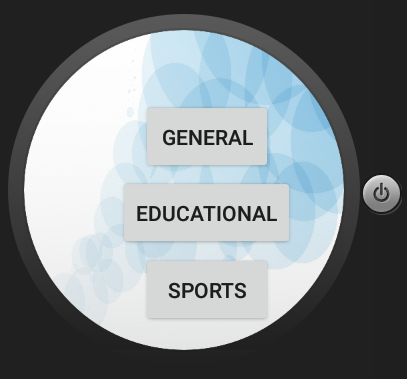
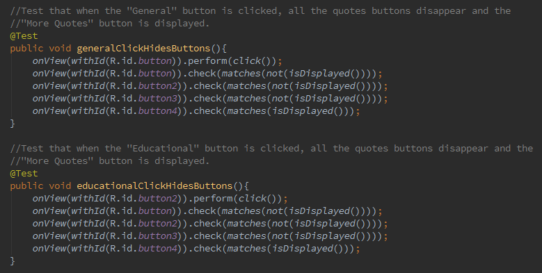
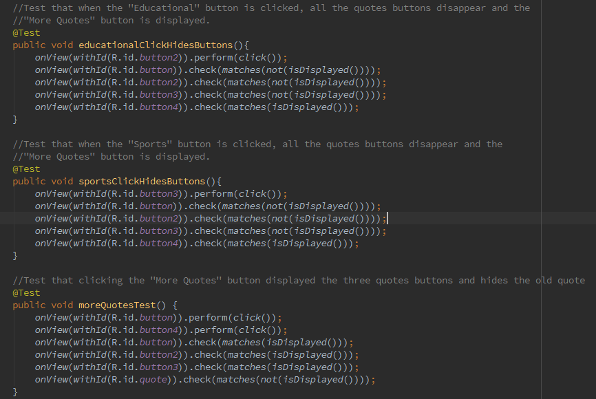
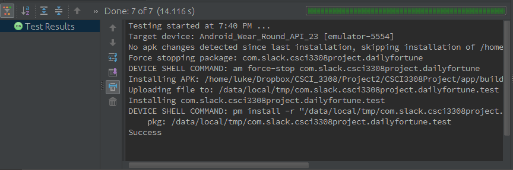

## Who
Calvin Ly, John Zavidniak, Carl Cortright, Luke Meszar, Chris Rhoda

## Title
Words of Encouragement

## Vision
Every smartwatch user should wake up with the proper words of encouragement to start their day off right. Not only should their day start off right, but continual encouragement throughout the day will lead to increased happiness and productivity. Motivation: Our motivation for this project is to develop an app that will be used everyday. We want our users to look forward to our messages and hopefully it’ll be a bright spot in their day.

## Automated Tests
Our team built an automated test suite using Espresso. Espresso is a testing platform that allows us to test the interactive functionality of our application. Our test file is located in app/src/androidTest/java/MainActivityTest.java

To run the automated tests, it is as simple as right-clicking on the Java test file and selecting "Run Test". When the test has completed, Android Studio will display which tests, if any have failed. Due to the fact that running our tests requires having Android Studio and a working Android Wear emulator, our team is willing to come in to demo our test code.  

Our team developed seven unit tests to test the functionality of our application.
##Tests 1-3
These tests check that the "General", "Educational", and "Sports" buttons display quotes correctly when the button is clicked by testing if the quotes textfield is displayed. 

##Tests 4-6
These tests check to make sure the "General", "Educational", and "Sports" buttons disappear to make room for the quote to be displayed. These tests also test that the "More Quotes" button appears when the "General", "Educational", and "Sports" buttons are clicked.

##Test 7
This test checks the functionality of the "More Quotes" button. Having the "General", "Educational", and "Sports" button reappear when the "More Quotes" button is clicked is tested. Having the "More Quotes" button disappear when it is clicked is tested. Finally, we test that the quote that is currently being displayed disappears when the "More Quotes" button is clicked.

Below are screenshots of our testing suite and application.

A screenshot of our application running

Below are three screenshots showing the code for our unit tests

Below is a screenshot of the results Android Studio displays after running the test cases

## User Acceptance Test Plan 1
| User Case ID | UC-01 |
| ---- | ---- |
| **User Case Name:** | Sports Quote Randomness |
| **Description:** | Ensure that a different quote is presented almost every time the user clicks on a quote category |
| **Users:** | Everyday Android Wear users  |
| **Preconditions:** | The sports table is populated with applicable quotes in the database. The app is opened and on the main page. |
| **Post-Conditions:** | A sports related quote is displayed on the screen |
| **Frequency of Use:** | Daily |

| Flow of Events: | Actor Action | System Response | Comments |
| ---- | ---- | ---- | ---- |
|      | 1. User presses sports quote button | A sports related quote is displayed  |      | 
|      | 2. User presses button to navigate back to main screen | The main screen is displayed, with the 3 options |      |
|      | 3. User presses sports quote button |  A sports related quote is displayed, it is a different quote than before ( 1 )    |      |

| Test Pass?: | --------------------------------------------------------- Pass / Fail ---------------------------------------------------------  |
| ---- | ---- |
| Notes and Issues |                                                            |

## User Acceptance Test Plan 2
| User Case ID | UC-02 |
| ---- | ---- |
| **User Case Name:** | General quote randomness |
| **Description:** | Ensure that a different general motivational quote is displayed each time the button is clicked, check that button to general quotes works, and check that the button back to the homepage works |
| **Users:** |  Everyday android wear users  |
| **Preconditions:** |  The general quote table in the database is populated with a variety of different quotes, and the app is on the main page |
| **Post-Conditions:** |  A general motivational quote is displayed on the screen   |

| Flow of Events: | Actor Action | System Response | Comments |
| ---- | ---- | ---- | ---- |
|      |  1. User presses general quote button  | A general motivational quote is displayed on screen  |      | 
|      |  2. User presses button to navigate back to the main screen |  The main screen is displayed, with the 3 different options |      |
|      |  3. User presses general quote button  | A general motivational quote is again displayed on the screen, this time it is different than the quote displayed after actor action 1     |      |

| Test Pass?: | --------------------------------------------------------- Pass / Fail ---------------------------------------------------------  |
| ---- | ---- |
| **Notes and Issues** |     |

## User Acceptance Test Plan 3
| User Case ID | UC-03 |
| ---- | ---- |
| **User Case Name:** | Educational quote randomness |
| **Description:** | Check that the button to educational quotes works, check that the button back to the homescreen works, and  ensure that a different education related motivational quote is displayed each time the button is pressed  |
| **Users:** | Everyday Android Wear Users |
| **Preconditions:** | The educational quote table in the database is populated with a variety of different quotes, and the app is on the main page |
| **Post-Conditions:** | An encouraging educational quote is displayed on the screen |

| Flow of Events: | Actor Action | System Response | Comments |
| ---- | ---- | ---- | ---- |
|      | 1. User presses educational quote button | An education themed quote is displayed on the screen  |      | 
|      |  2. User presses the button to navigate back to the main screen  | The main screen is displayed, with the 3 different options |      |
|      |  3. User presses educational quote button | Another education themed quote is displayed on the screen, this one different than the one displayed after Actor Action 1   |      |

| Test Pass?: | --------------------------------------------------------- Pass / Fail ---------------------------------------------------------
| ---- | ---- |
| **Notes and Issues** |     |
